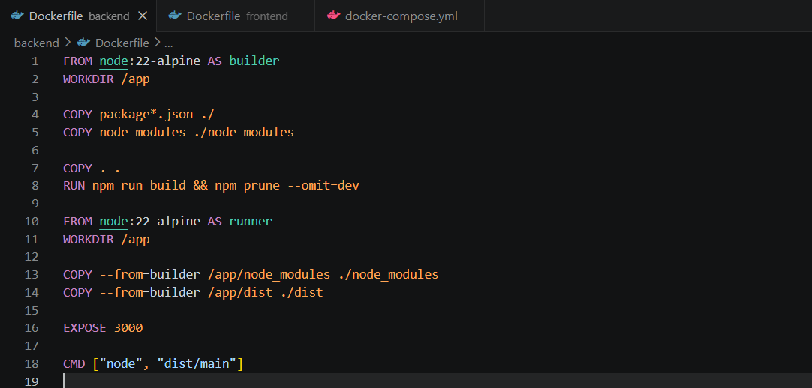
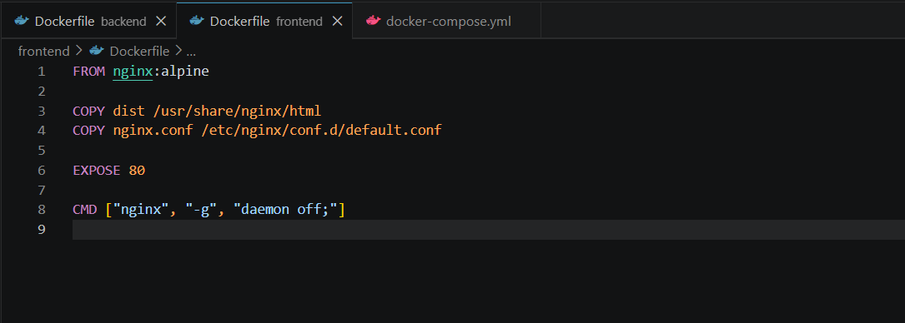
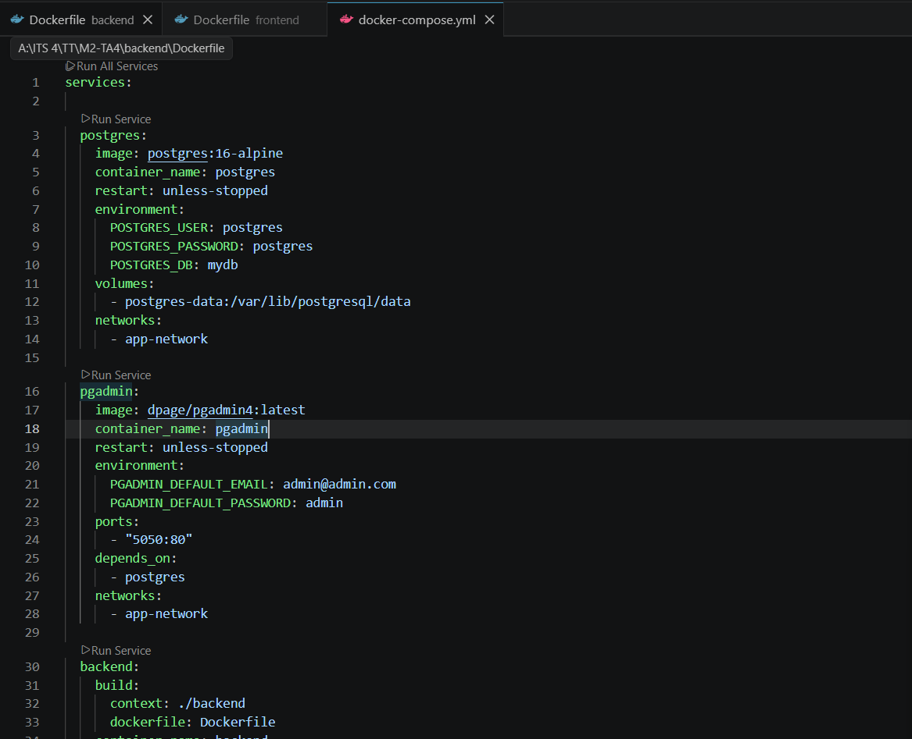
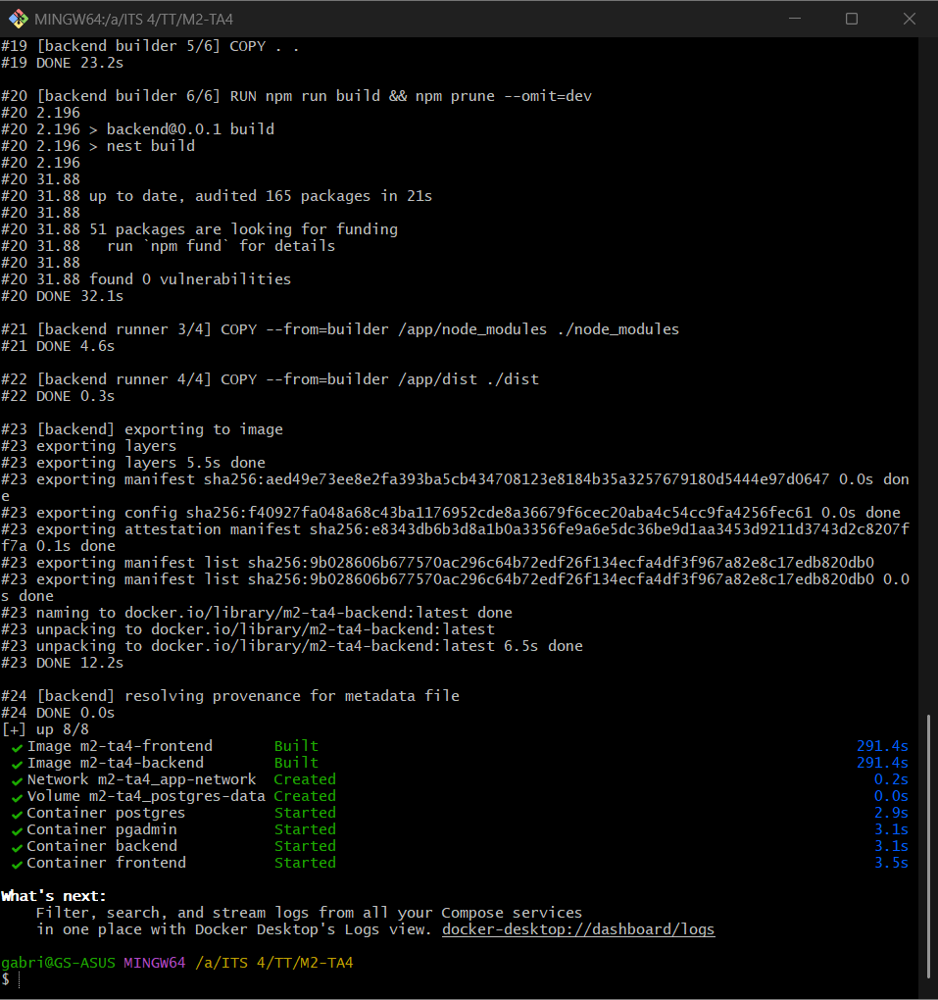
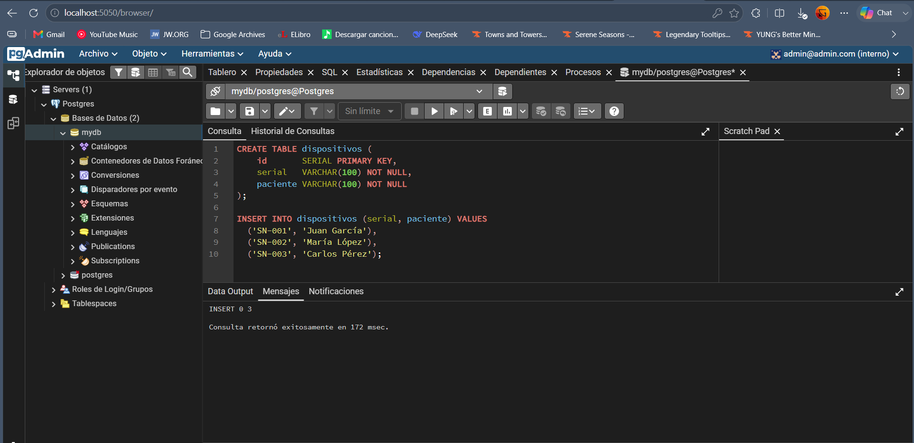

# Práctica Despliegue FRONT y BACK con BD local

Estudiante: Gabriel Sotomayor

Fecha: 10/6/2026

Duración: 2h

## Fundamentos

### Contenedorización y Docker

Contenerizar apps es una técnica que permite empaquetar una aplicación junto con todas sus dependencias, configuraciones y bibliotecas necesarias para su ejecución. Esto garantiza que el software funcione de manera consistente en diferentes entornos. Consumen menos recursos que las VM. (Openja et al., 2022; Morris et al., 2017).

Docker es una plataforma de código abierto diseñada para automatizar la creación, distribución y ejecución de aplicaciones mediante contenedores. Su principal ventaja es que encapsula una app y su entorno de ejecución en una imagen portátil. Funciona consistententemente en cualquier infraestructura compatible con Docker (Openja et al., 2022; Yepuri et al., 2023).

### Imágenes y Contenedores Docker

Una imagen Docker es una plantilla que contiene todos los elementos necesarios para ejecutar una aplicación. A partir de una imagen se pueden crear uno o varios contenedores. Las imágenes permiten distribuir aplicaciones de forma estandarizada. En cambio los contenedores proporcionan aislamiento de procesos, redes y sistemas. (Docker Inc., 2025).

### Dockerfile

El Dockerfile es un archivo de texto que contiene un conjunto de instrucciones para construir una imagen Docker. En este archivo se define la imagen base, las dependencias necesarias, los comandos de compilación y la configuración requerida para ejecutar la aplicación. Para Frontend, es común utilizar construcciones multinivel (multi-stage builds), donde una primera etapa compila el proyecto y una segunda etapa utiliza un servidor web ligero, como Nginx, para servir los archivos generados. Así se reduce el tamaño final de la imagen (Docker Inc., 2025).

### Docker Compose

Docker Compose es una herramienta que permite definir y administrar apps compuestas por múltiples contenedores mediante un archivo de configuración YAML llamado compose.yaml. Permite la orquestación de servicios, redes, volúmenes y variables de entorno desde un único archivo. Esto simplifica el despliegue de aplicaciones completas. (Docker Inc., 2025).

### Frontend en Contenedores

Frontend desarrollado con frameworks modernos como React, Angular o Vue generan archivos estáticos HTML, CSS y JavaScript durante la compilación. Estos archivos pueden ser desplegados dentro de un contenedor Docker utilizando un servidor web ligero. (Docker Inc., 2025).

### Nginx como Servidor Web para Frontend

Nginx es un servidor web de alto rendimiento ampliamente utilizado para servir contenido estático y actuar como proxy inverso. En aplicaciones Frontend desplegadas con Docker, Nginx suele emplearse para distribuir los archivos generados durante la compilación del proyecto. (Docker Inc., 2025).

### Buenas Prácticas

Entre las principales buenas prácticas para desplegar aplicaciones FrontEnd con Docker se encuentran el uso de imágenes ligeras, la implementación de construcciones multinivel, la exclusión de archivos innecesarios mediante .dockerignore, la separación de entornos de desarrollo y producción, y el uso de servidores especializados como Nginx para servir contenido estático. Estas prácticas contribuyen a mejorar la seguridad, el rendimiento, la mantenibilidad y la eficiencia del despliegue (Docker Inc., 2025).

### Bibliografía

- Docker Inc. (2025). Containerize a React.js application. Docker Documentation. https://docs.docker.com/guides/reactjs/containerize/

- Docker Inc. (2025). How Compose works. Docker Documentation. https://docs.docker.com/compose/compose-application-model/

- Docker Inc. (2025). React.js language-specific guide. Docker Documentation. https://docs.docker.com/guides/reactjs/

- Docker Inc. (2025). Use containers for React.js development. Docker Documentation. https://docs.docker.com/guides/reactjs/develop/

- Eng, K., Hindle, A., & Stroulia, E. (2023). Patterns of multi-container composition for service orchestration with Docker Compose. arXiv. https://arxiv.org/abs/2305.11293

- Openja, M., Majidi, F., Khomh, F., Chembakottu, B., & Li, H. (2022). Studying the practices of deploying machine learning projects on Docker. arXiv. https://arxiv.org/abs/2206.00699

- Piedade, B., Dias, J. P., & Correia, F. F. (2022). Visual notations in container orchestrations: An empirical study with Docker Compose. arXiv. https://arxiv.org/abs/2207.09167

- Horton, E., & Parnin, C. (2019). DockerizeMe: Automatic inference of environment dependencies for Python code snippets. arXiv. https://arxiv.org/abs/1905.11127

## Conocimientos previos

Necesario tener claro los siguientes temas:

* Manejo de GitBash
* Nomenclatura de Dockerfile
* Nomenclatura de Docker Compose
* Comandos docker

## Objetivos

* Dominar el despliegue de un sistema completo con FRONT, BACK, y BD usando docker.
* Crear imagenes personalizadas y docker compose para desplegar un sistema completo de software.

## Equipo necesario:

* Computadora.
* Terminal de GitBash.
* Docker Desktop instalado.
* Un proyecto funcional FRONT
* Un proyecto funcional BACK.

## Material de apoyo

* Guía de comandos básicos Docker.
* Guía de nomenclatura para Dockerfile.
* Guía de nomenclatura para Docker Compose.

## Procedimiento

1. Generar un front y un back

2. Crear el dockerfile del back:

3. Crear el dockerfile del front:

4. Crear el docker-compose para levantar:
- Imagenes de pgadmin y postgresql.
- Imagenes del backend y el frontend

5. Hacer el build de los contenedores:

6. Aujtenticarse en PgAdmin y crear la tabla "dispositivos" en la BD, con los campos "id, serial, paciente".

7. Visualizar en el front la tabla:

## Resultados

1. Generar un front y un back

2. Crear el dockerfile del back:

3. Crear el dockerfile del front:

4. Crear el docker-compose para levantar:
- Imagenes de pgadmin y postgresql.
- Imagenes del backend y el frontend

5. Hacer el build de los contenedores:

6. Aujtenticarse en PgAdmin y crear la tabla "dispositivos" en la BD, con los campos "id, serial, paciente".

7. Visualizar en el front la tabla:

